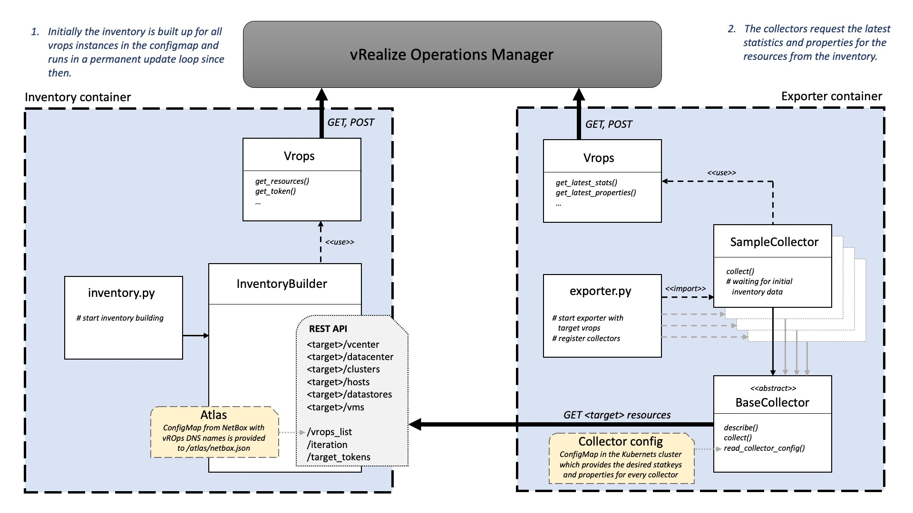

[](https://coveralls.io/github/sapcc/vrops-exporter?branch=master)

# vrops-exporter
Prometheus exporter to scrape metrics from vRealize Operations Manager

## Running the exporter

The exporter consists of two main components:

- **inventory**

    The inventory retrieves all VMware resources by `name` and `uuid` from the vROps application interface, preserving the original parent-child relationships.         Likewise, it reads the atlas config file to know all the DNS names of the vrops targets. 
    
  * `--user`: specifiy user to log in
  * `--password`: specify password to log in
  * `--port`: specify inventory port
  * `--atlas`: path to atlas config file 
  * `--v`: logging all level except debug
  * `--vv`: logging all level including debug
  * `--loopback`: use 127.0.0.1 address instead of listen to 0.0.0.0 (for test purpose)
  * `--sleep`: how often the resources are updated, default: 1800s
  
  [atlas](https://github.com/sapcc/atlas) refers to our netbox extractor, which is in the end providing netbox data as a configmap in k8s. You don't have to use it, a json file with this structure would be sufficient, too.
   If case the WSGI server can't be connected to you might want to try `--loopback` to hook up the loopback interface (127.0.0.1).

   ```json 
   [
     {
         "labels": {
             "job": "vrops",
             "server_name": "vrops.dns.address",
         }
     },
     { ... }
   ]
   ```
  
- **exporter**

    The exporter can be started with a specific `target` and/or a specific `collector` and/or specific `rubric` (rubrics defined in the collector config). This is important to provide smaller and also faster exporters in the landscape.
    
  * `--port`: specify exporter port
  * `--inventory`: inventory service address
  * `--config`: path to config to set default collectors, statkeys and properties for collectors
  * `--target`: define target vrops
  * `--collector`: enable collector (use multiple times)
  * `--rubric`: metric rubric in collector config
  * `--v`: logging all level except debug
  * `--vv`: logging all level including debug
  
  An example [collector-config](tests/collector_config.yaml). Add the desired `statkeys` and `properties` that your collectors should collect in a dedicated category. This is where pairs of a `statkey` and a `metric_suffix` are described. The `statkey` follows VMware notation and the `metric_suffix` follows best practices as it should appear in prometheus.
  
  **Metrics:**
 [VMWARE Documentation | Metrics for vCenter Server Components](https://docs.vmware.com/en/vRealize-Operations-Manager/8.2/com.vmware.vcom.metrics.doc/GUID-9DB18E49-5E00-4534-B5FF-6276948D5A09.html)
 
  **Properties:**
 [VMWARE Documentation | Properties for vCenter Server Components](https://docs.vmware.com/en/vRealize-Operations-Manager/8.2/com.vmware.vcom.metrics.doc/GUID-0199A14B-019B-4EAD-B0AF-59097527ED59.html)
 
  **Prometheus:**
 [Prometheus | Metric and label naming](https://prometheus.io/docs/practices/naming/)
  

In the past, the two parts were in one startup script (exporter.py), but this didn't really work, because restarting the exporter always had to wait for a complete rebuild of the inventory. 

Therefore, one part permanently builds the inventory and makes it available to the exporter. The exporter fetches the data via HTTP requests and uses them to execute the actual vROps queries.

#### 1. Build


   To build the container simply run `make` and get the locally created docker container.


#### 2. CLI

   Either specify the vars via environment or cli params. Because the inventory and the exporter are running seperately,
   you need to enter the Docker container at least twice. Start the container:
    
    docker run -it keppel.eu-de-1.cloud.sap/ccloud/vrops_exporter /bin/sh

   This will start the container and directly enter the shell. Start the inventory:
    
    ./inventory.py -u foobaruser -p "foobarpw" -a /atlas/netbox.json -o 80 -d
    
   Now you need to enter the container a second time:
    
    docker exec -it <container_name> /bin/sh
        
   Now run the exporter:
    
    ./exporter.py -o 9000 -i localhost -d
       
   You can also enter the container a third time to fetch the prometheus metrics from localhost (i.e. with wget)


#### 3. Enviroment variables

    ```
    USER
    PASSWORD
    PORT
    INVENTORY
    LOOPBACK
    ```

For running this in kubernetes (like we do), you might want to have a look at our [helm chart](https://github.com/sapcc/helm-charts/tree/master/prometheus-exporters/vrops-exporter)

## Architecture




## Test
Test module is called using ENV variables. Specifying these on the fly would look like this:

Main test:
```
LOOPBACK=0 DEBUG=0 INVENTORY=127.0.0.1:8000 USER=FOO PASSWORD=Bar python3 tests/TestCollectors.py
```

To run all tests you got to loop over it.
```
for i in $(ls tests/Test*)
do
  LOOPBACK=1 INVENTORY="127.0.0.1:8000" DEBUG=0 USER=FOO PASSWORD=Bar python3 $i
done
```

Please note that USER and PASSWORD are currently doing nothing at all, they are only passed on because the test
checks whether these are present.

The test generates dummy return values for the queries to vROps and checks the functionality of the collectors. 
It compares whether the metrics as a result of the collector match the expected metrics in `metrics.yaml`. 

The developed collector must pass the test before it can be added to the master branch. 
When a pull request is opened, this test is performed automatically.
