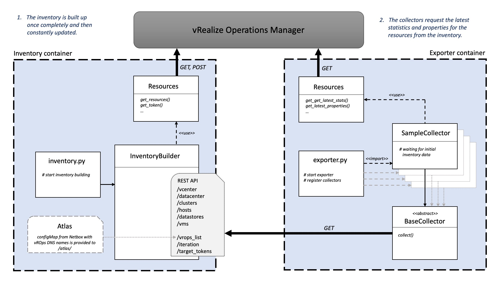

# vrops-exporter
Prometheus exporter to scrape metrics from vRealize Operations Manager

### Running the exporter

The container is defaulting to /vrops-exporter path. 
Use exporter.py with one of the two ways of specifying the necessary credentials. 
They could also be mixed of course.

1. CLI

    ```
    Usage: pyhton3 exporter.py [options]
    ```
    Options:
    
    short | long | description
    --- | --- | ---
      -h | --help |           show this help message and exit
      -u USER | --user=USER | specify user to log in
      -p PASSWORD | --password=PASSWORD | specify password to log in
      -o PORT | --port=PORT | specify exporter port
      -a | --atlas | specify atlas configfile 
      -d | --debug    |       enable debug


2. Enviroment variables

    ```
    USER
    PASSWORD
    PORT
    ```
### Architecture



### How to develop a collector

1. [optional] Provide a simple JSON configfile that contains at least one resource in the structure shown below to the main directory. 

    ```json
    [
       {
          "labels": {
                   "job": "vrops",
                   "server_name": "VROPS_DNS_NAME" 
          }
       }
    ]
    ```
2. **[Option 1]** Add the desired *statkeys* that the collector should collect in a dedicated category to `statkey.yaml`. 
This is where pairs of a *statkey* and a *label* are described. The *statkey* follows VMWARE notation and the *label* 
follows best practices as it should appear in prometheus.
    
    statkey:
    [VMWARE Documentation | Metrics for vCenter Server Components](https://docs.vmware.com/en/vRealize-Operations-Manager/7.5/com.vmware.vcom.metrics.doc/GUID-9DB18E49-5E00-4534-B5FF-6276948D5A09.html)
    
    label:
    [Prometheus | Metric and label naming](https://prometheus.io/docs/practices/naming/)
    
    ```yaml
    HostSystemStatsCollector:
       - label: "memory_usage_average_percentage"
         statkey: "mem|usage_average"
       - label: "summary_running_VMs_number"
         statkey: "summary|number_running_vms"
    ```
   
    **[Option 2]** Add *properties* to `property.yaml` using the same logic as **[Option 1]**. 
    
    property:
    [VMWARE Documentation | Properties for vCenter Server Components](https://docs.vmware.com/en/vRealize-Operations-Manager/7.5/com.vmware.vcom.metrics.doc/GUID-0199A14B-019B-4EAD-B0AF-59097527ED59.html)

    ```yaml
    HostSystemPropertiesCollector:
       enum_metrics:
           - label: "runtime_powerState"
             expected: "Powered On"
             property: "runtime|powerState"
           - label: "runtime_connectionState"
             expected: "connected"
             property: "runtime|connectionState"
       info_metrics:
           - label: "config_product_apiVersion"
             property: "config|product|apiVersion"
           - label: "cpu_cpu_model"
             property: "cpu|cpuModel"
       number_metrics:
           - label: "config_diskSpace_bytes"
             property: "config|diskSpace"
           - label: "config_network_number_of_nnic"
             property: "config|network|nnic"      
    ```

3. Create a new collector in the folder `/collectors/`
4. Import `Resources` to get query methods for *stats* or *properties* to vROps.
There are methods for querying **one** *statkey* or  **one** *property* for **multiple** resources. 
Or, where appropriate, single queries of *statkey* or *property* per resource. 
The single queries are not recommended for multiple queries. 
5. Make sure you inherit from the `BaseCollector`. Look at how the HostSystemCollector is structured. 
6. Run queries to the internal REST API to get the necessary resources for your collector.
For example `get_hosts` for HostSystem resources or `get_clusters` for Cluster Compute resources. 
It's also important to use the same token already generated for building the inventory for further queries to a vROps.
This **token** can be retrieved from the REST API with `get_target_tokens`. 
7. Import and register your collector in exporter.py. 

 ### Test
Test module is called using ENV variables. Specifying these on the fly would look like this:

```
DEBUG=0 USER=foo PASSWORD=bar python3 tests/TestCollectors.py
```

Please note that USER and PASSWORD are currently doing nothing at all, they are only passed on because the test
checks whether these are present.

The test generates dummy return values for the queries to vROps and checks the functionality of the collectors. 
It compares whether the metrics as a result of the collector match the expected metrics in `metrics.yaml`. 

The developed collector must pass the test before it can be added to the master branch. 
When a pull request is opened, this test is performed automatically.
