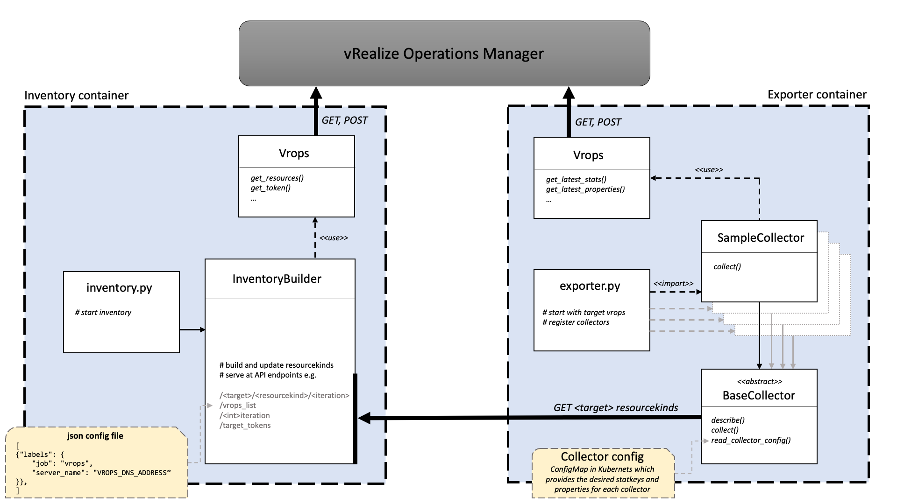

[](https://coveralls.io/github/sapcc/vrops-exporter?branch=master)

# vrops-exporter
Prometheus exporter for VMware vRealize Operations Manager

###### Tested and compatible with vROps 6.5 up to vROps v8.6.2

### Table of Contents

[Design](#design)

[Supported adapters and resourcekinds](#supported-adapters-and-resourcekinds)

[Running the software](#running-the-software)

[Running in Kubernetes](#running-in-kubernetes)

[Test](#test)

## Design

The exporter is divided in two main components, [inventory](#inventory) and [exporter](#exporter). 
The inventory is providing the resource-uuids (unique unit identifier) from vROps via a REST interface to the exporter

#### inventory

The inventory collects all supported resourcekinds in their parent-child relation, and makes them available at an internal API. 
The resourcekinds are updated by a continuous cycle that can be configured with `--sleep`. The inventory preserves data through iterations. 
The last two iterations for these cycles are always provided via the endpoints and in order to know which iteration to fetch, 
latest iteration needs to be queried first.

To have more control over the resources to be collected, they can be filtered by _resourcestatus_, _resourcehealth_ and _resourcestate_ in [inventory-config](tests/inventory_config.yaml).

###### inventory endpoints
```shell
GET

/target                                           # vrops FQDN
/<target>/<resourcekind>/<int:iteration>          # path for each resourcekind
/alertdefinitions/                                # vrops integrated alertdefinitions
/iteration                                        # current inventory iteration
/amount_resources                                 # amount of resources for each resourcekind
/collection_times                                 # measured time for a inventory run per vrops
/api_response_codes                               # HTTP response codes per resourcekind GET request
/target_tokens                                    # dict with vrops: auth token
```
#### exporter

The second component are the collectors that exist for each resourcekind as well as for metrics, properties and alerts. 
Each collector performs only one task - one resourcekind and one type from the three different values. First, the resourcekinds in question are 
queried at the inventory's internal API. In the second step, the values, properties or alarms are queried. From these, 
the Prometheus metrics are generated. To complete the picture, the metrics are enriched with the labels from the resourcekind relationships 
created in the inventory.



To avoid multiple implementations of functionality, the collectors follow an inheritance structure.


## Supported adapters and resourcekinds

This sections shows how vROps internal resourcekind relationsships are used in the exporter as a hierarchical tree.

#### VMware vCenter Server

Resourcekind relationship:
```shell
VMwareAdapter Instance:
    Datacenter:
        VmwareDistributedVirtualSwitch
        Datastore
        ClusterComputeResource:
            HostSystem:
                Virtualmachine
```

#### VMware NSX-T Adapter

Resourcekind relationship:
```shell
NSXTAdapter:
    ManagementCluster:
        ManagementNode:
            ManagementService
        TransportZone:
            TransportNode
        LogicalSwitch
```

#### SDDC (Software-Defined Data Center) Health Adapter

SDDC resourcekinds can be defined in [inventory-config](tests/inventory_config.yaml):

```yaml
resourcekinds:
    sddc_resourcekinds:
      - "NSXT Server"
      - "VCENTER"
      - "NSXVPostgresService"
      - "SSHService"
      - "NSXReplicatorService"
      - "NSXRabbitmqService"
      - "NSXManagerService"
      - "NSXControllerService"
      - "SDDCHealth Instance"
      - "vCenterBackupJob"
```

#### VCOPS (vCenter Operations) Adapter

VCOPS resourcekinds can be defined in [inventory-config](tests/inventory_config.yaml):

```yaml
resourcekinds:
    vcops_resourcekinds:
      - "vC-Ops-Analytics"
      - "vC-Ops-CaSA"
      - "vC-Ops-Cluster"
      - "vC-Ops-Collector"
      - "vC-Ops-Node"
      - "vC-Ops-Suite-API"
      - "vC-Ops-Watchdog"
```

## Running the software

#### **inventory**

The inventory must be started with a specific `target`

  * `--user`: specifiy user to log in
  * `--password`: specify password to log in
  * `--port`: specify inventory port
  * `--target`: define target vrops
  * `--config`: path to inventory config to set query filters (and resourcekinds - SDDC & VCOPS only)
  * `--v`: logging all level except debug
  * `--vv`: logging all level including debug
  * `--loopback`: use 127.0.0.1 address instead of listen to 0.0.0.0 (for test purpose)
  * `--sleep`: how often the resources are updated, default: 1800s


#### **exporter**

The exporter must be started with a specific `target`. Optionally a specific `collector`, otherwise the `default_collectors` in [collector-config](tests/collector_config.yaml) were used.
    
  * `--port`: specify exporter port
  * `--inventory`: inventory service address
  * `--config`: path to config to set default collectors, statkeys and properties for collectors
  * `--target`: define target vrops
  * `--collector`: enable collector (use multiple times)
  * `--rubric`: metric rubric in collector config
  * `--v`: logging all level except debug
  * `--vv`: logging all level including debug
  
  An example [collector-config](tests/collector_config.yaml). Add the desired `statkeys` and `properties` that your collectors should collect in a dedicated category. This is where `statkey` mapped to a `metric_suffix`. The `statkey` follows VMware notation (to make the API call) and the `metric_suffix` follows best practices as it should appear as a metric in prometheus.
  
  Metrics:
 [VMWARE Documentation | Metrics for vCenter Server Components](https://docs.vmware.com/en/vRealize-Operations/8.10/com.vmware.vcom.metrics.doc/GUID-9DB18E49-5E00-4534-B5FF-6276948D5A09.html)
 
  Properties:
 [VMWARE Documentation | Properties for vCenter Server Components](https://docs.vmware.com/en/vRealize-Operations/8.10/com.vmware.vcom.metrics.doc/GUID-0199A14B-019B-4EAD-B0AF-59097527ED59.html)
 
  Prometheus:
 [Prometheus | Metric and label naming](https://prometheus.io/docs/practices/naming/)
 
In addition, vrops-exporter is able to fetch alerts from supported resource types and wrap them in an info metric containing all symptoms and recommendations. 

```javascript
vrops_hostsystem_alert_info{
    alert_impact="HEALTH", 
    alert_level="CRITICAL", 
    alert_name="The host has lost connectivity to a dvPort", 
    datacenter="datacenter1", 
    description="One or more portgroups in the host lost connectivity to the dvPort. As a result, the services associated with the affected dvPorts are         
        disconnected from the associated physical networks. All physical connections to the dvPort from the associated switch will become unavailable.", 
    hostsystem="node001-prod1", 
    recommendation_1="Replace the physical adapter or reset the physical switch. The alert will be canceled when connectivity is restored to the dvPort.",      
    status="ACTIVE", 
    symptom_1_data="{'condition': {'faultEvents': ['esx.problem.net.dvport.connectivity.lost'], 'faultKey': 'fault|dvp|conn', 'type': 'CONDITION_FAULT'}, 
        'severity': 'CRITICAL'}", 
    symptom_1_name="Lost network connectivity to DVPorts", 
    vccluster="prod-cluster1", 
    vcenter="vcenter1"
    }
```
 

###### **1. Build**
To build the container simply run `make` and get the locally created docker container.

###### **2. CLI**

   Either specify the vars via environment or cli params. Because the inventory and the exporter are running seperately,
   you need to enter the Docker container at least twice.

Start the container:

       docker run -it keppel.eu-de-1.cloud.sap/ccloud/vrops_exporter /bin/sh

   This will start the inventory container and directly enter the shell. Note, you need to define your vROps target beforehand [tests/inventory_config.yaml](tests/inventory_config.yaml#L1-L2).
    
       ./inventory.py --user foobaruser --password "foobarpw" --port 80 -m tests/inventory_config.yaml --vv
    
   Now you need to enter the container a second time:
    
       docker exec -it <container_name> /bin/sh
        
   Now run the exporter:
    
       ./exporter.py --port 9000 --inventory localhost --config tests/collector_config.yaml --target 'vrops-vcenter-test.company.com' --vv
       
   You can also enter the container a third time to fetch the prometheus metrics from localhost (i.e. with wget)

###### **3. Enviroment variables**

    
        USER
        PASSWORD
        PORT
        INVENTORY
        LOOPBACK


## Running in Kubernetes
For running this in kubernetes (like we do), you might want to have a look at our [helm chart](https://github.com/sapcc/helm-charts/tree/master/prometheus-exporters/vrops-exporter)


## Test
Test module is called using ENV variables. Specifying these on the fly would look like this:

Main test:
```shell
LOOPBACK=0 DEBUG=0 INVENTORY=127.0.0.1:8000 USER=FOO PASSWORD=Bar CONFIG=tests/collector_config.yaml TARGET=vrops-vcenter-test.company.com python3 tests/TestCollectors.py
```

To run all tests you got to loop over it.
```shell
for i in $(ls tests/Test*)
do
  LOOPBACK=1 INVENTORY="127.0.0.1:8000" DEBUG=0 USER=FOO PASSWORD=Bar python3 $i
done
```

Please note that USER and PASSWORD are currently doing nothing at all, they are only passed on because the test
checks whether these are present.

The test generates dummy return values for the queries to vROps and checks the functionality of the collectors. 
It compares whether the metrics as a result of the collector match the expected metrics in `metrics.yaml`. 
